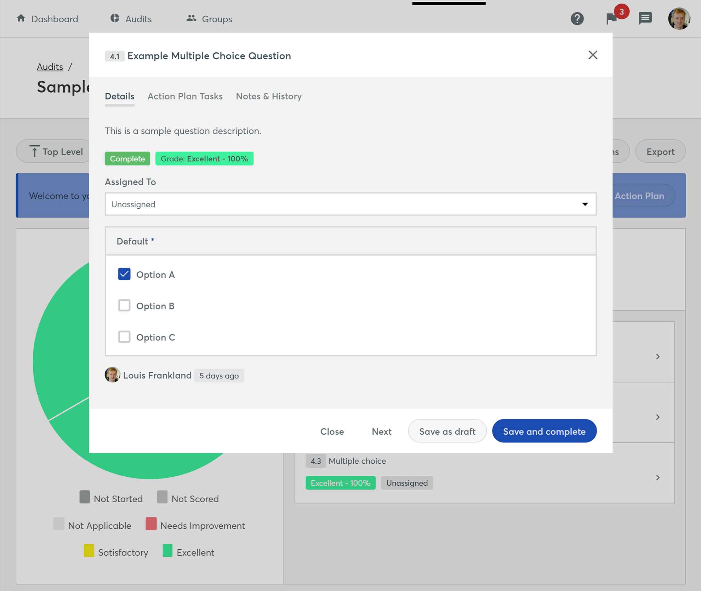
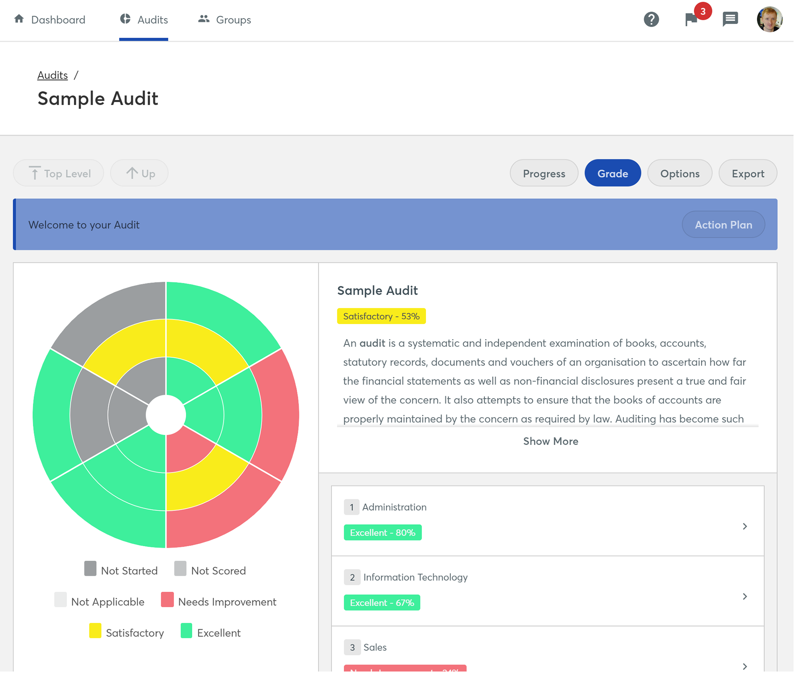
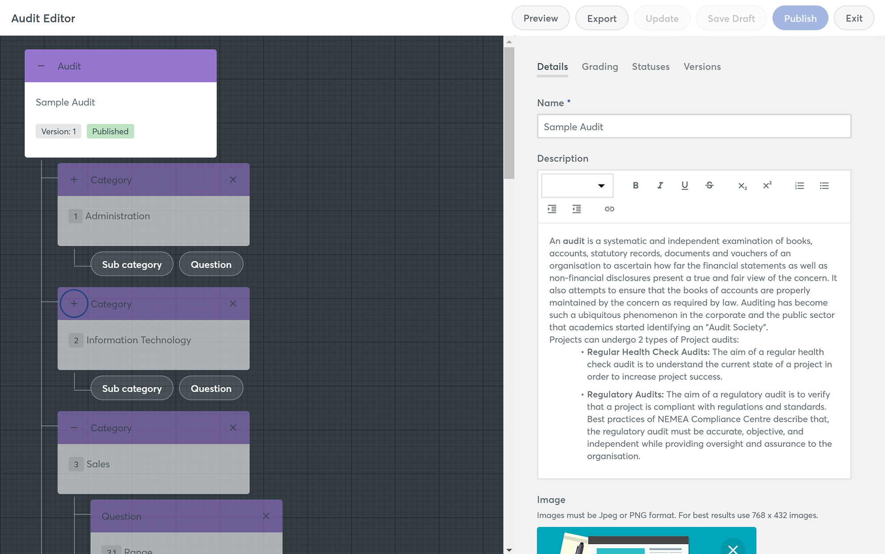

## The challenge

Allowing organisations to remotely carry out in-depth audits of polices and procedures across multiple sectors and audiences.

## My role

User Research, User Experience Design, Personas, Documentation, Frontend, HTML, CSS, Sass

## Background

Enable Audit arose after speaking with existing customers and identifying a need for them to track their compliance across multiple locations in a data-secure manner. They were doing this by paper or spreadsheets which had a high administration burden and low return rate from those asked to complete them.

## Research

As well as reviewing competitors, we carried out surveys for customers and conducted user interviews to gain a holistic view of the processes, bottlenecks and how they perceived them. From these interviews and surveys.

## Conceptualization

From the research, user personas, journey maps and workflows were produced as part of an agile team. Facilitating multiple workshops with developers, product owners and stakeholders to gain a broad perspective about what was possible and identify where value could be most gained.

## Wireframing and prototyping

Working iteratively to create paper wireframes in the early stages and getting regular feedback from members of the team and potential clients. These evolved into interactive wireframes, which allowed the product and development team to understand the solution we were aiming to build. As the process evolved, I worked closely with the product owner to document each of the features so they can be developed as part of an agile team.

## Frontend development

As well as designing the product, I also developed the frontend. This involved building new components and revising others for the Virtual College Pattern Library. The components were hand coded in HTML and Sass with each one tested for accessibility, compatibility and performance. I coached the development team to ensure best practice was used when implementing these in the final code.
