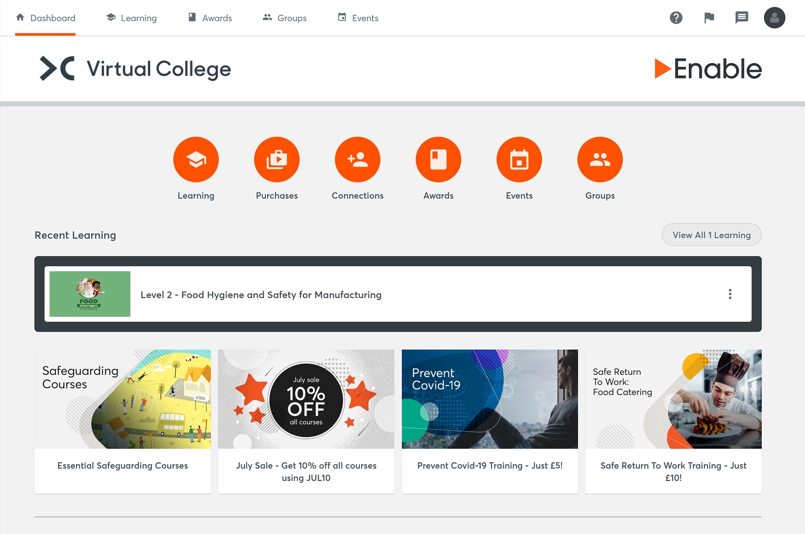
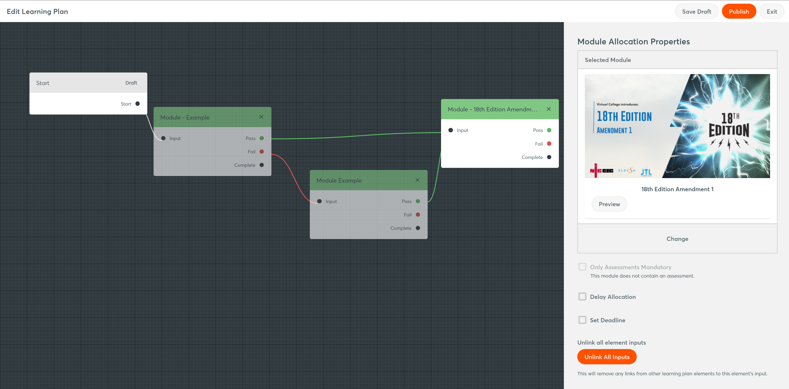
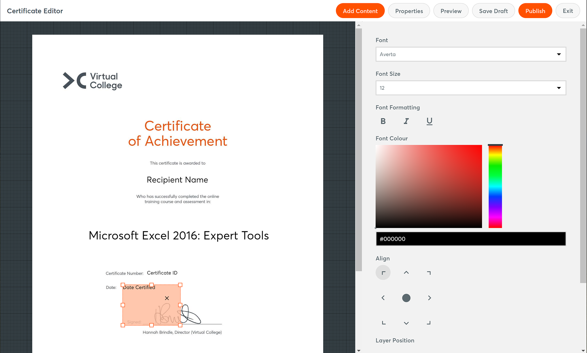
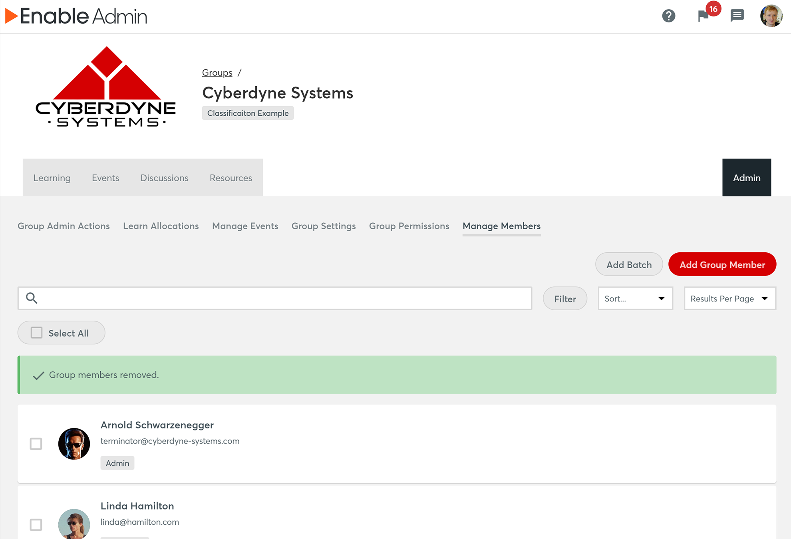

As the UX developer for Enable LMS, I delivered throughout the lifecycle of feature development.

Conceptualising all features such as learner management, including powerful automation, course editing, including assessment and evaluation tools, resource management and many other intrinsic parts of the platform.

Working with customers, product managers, management stakeholders and developers to rapidly iterate on designs to get the right digital tools for our end users.

As well as designing and documenting these features, I created and managed the frontend (HTML & CSS) of Enable LMS. Using a component pattern library to ensure the platform was accessible to WCAG AA standards and improve development speed. 

Using my skills and expertise flexibly both in and out of agile-development sprints, I contributed across the board from helping shape the direction of Enable LMS to rapidly fixing issues and engaging with customers directly.

My role also included usability testing new and existing features to get valuable feedback to constantly improve the product.

