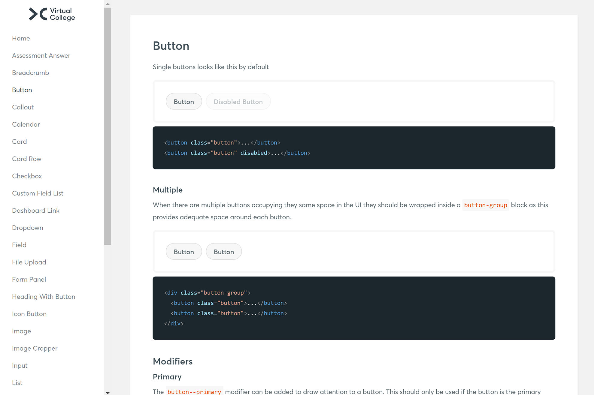

The Virtual College Frontend Pattern Library was used to rapidly build new features and standardise the development process across multiple applications. The goal was to facilitate consistency, reusability and reduce maintenance.

I developed and maintained the components to ensure they were accessible, browser-compliant and responsive across devices.

I developed new components where they were needed, coaching developers through the best use of the pattern library and how to implement it in production. 

